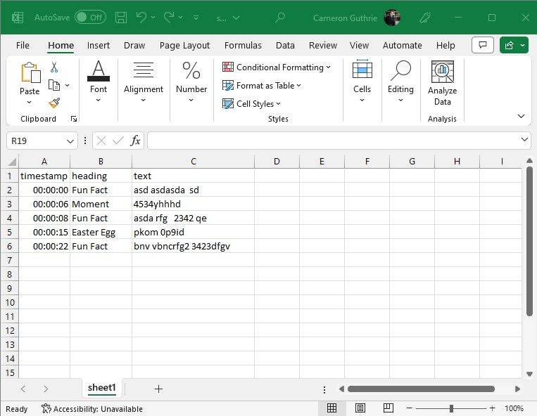

# 👋 CSV to SRT (Premier Pro format)

This app reads subtitle information from a CSV file and generates an SRT file for premier pro. Follow the steps below to install and run the app on your system. We'll make it simple and easy to follow along! 😃

## 📋 Prerequisites

Ensure you have [Node.js](https://nodejs.org/) installed on your system. You can verify the installation by running the following command in your terminal:

```bash
node --version
```

You should see the version of your Node.js.

## 🚀 Getting Started

### Step 1: Clone the Repository

Start by cloning this repository to your local machine using git:

```bash
git clone https://github.com/CameronGuthrie/CSV-to-SRT.git
cd CSV-to-SRT
```

### Step 2: Install Dependencies

Our application requires the `csv-parser` library. Once you have changed directory into the CSV-to-SRT directory install them by running:

```bash
npm install csv-parser
```

### Step 3: Configure the Application

You'll need to provide a CSV file for the application to parse. The format is important for this and an example can be seen here.

```csv
timestamp,heading,text
00:00:00,Fun Fact,asd asdasda  sd
00:00:06,Moment,4534yhhhd
00:00:08,Fun Fact,asda rfg   2342 qe
00:00:15,Easter Egg,pkom 0p9id
00:00:22,Fun Fact,bnv vbncrfg2 3423dfgv
```

Here is what this would look like in Microsoft Excel (remember to save it as a .csv).



### Step 4: Run the Application

#### Linux and Mac

You can set environment variables and run the app using the following command in the terminal. Here, we're using a .csv file located at `/path/to/your.csv`, and the SRT file will be named `output.srt`, with a subtitle length of `00:00:04`.

```bash
CSV="/path/to/your.csv" SRT="output.srt" LEN="00:00:04" node app.js
```

After a successful run, you'll see the message "SRT file has been created successfully."

You can change the `CSV`, `SRT`, and `LEN` environment variables as required and run the app again to create different SRT files. 

For instance, if you have another .csv file at `/another/path/to/your.csv`, and you want the SRT file to be named `new_output.srt` with a subtitle length of `00:00:05`, you would use:

```bash
CSV="/another/path/to/your.csv" SRT="new_output.srt" LEN="00:00:05" node app.js
```

#### Windows

For Windows Command Prompt, use `set` to specify the environment variables:

```cmd
set CSV=C:\path\to\your.csv && set SRT=output.srt && set LEN=00:00:04 && node app.js
```

To specify different files or parameters, adjust the values accordingly. For example:

```cmd
set CSV=C:\another\path\to\your.csv && set SRT=new_output.srt && set LEN=00:00:05 && node app.js
```

For Windows PowerShell, use the following format:

```powershell
$env:CSV="C:\path\to\your.csv"; $env:SRT="output.srt"; $env:LEN="00:00:04"; node app.js
```

Again, to specify different files or parameters, adjust the values:

```powershell
$env:CSV="C:\another\path\to\your.csv"; $env:SRT="new_output.srt"; $env:LEN="00:00:05"; node app.js
```

Enjoy converting CSV files to SRT format with ease! 🎉🚀

## 📝 License

This project is [MIT](https://choosealicense.com/licenses/mit/) licensed.

## 🙏 Thanks

We hope you find this project helpful. If you have any questions, please don't hesitate to raise an issue or submit a pull request. Happy coding! 🎉
